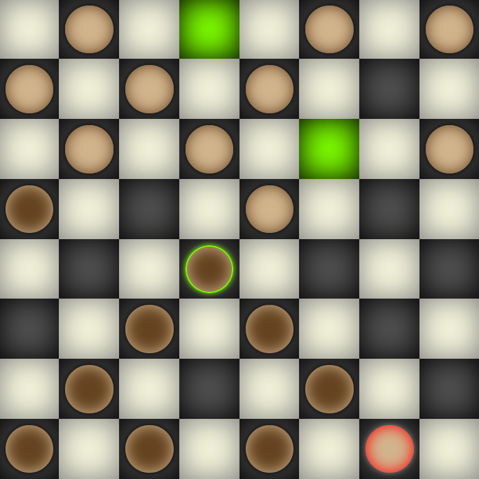

# Checkers

## Usage

You can simply play this in the browser: [davidpomerenke.github.io/checkers](https://davidpomerenke.github.io/checkers)

For development, clone the repository and `npm start`.

## Bugs

If you spot a bug, please create an issue. The game logs some information to the web console (`ctrl` `shift` `i`), which you could copy and paste (you do not need to format it). Thank you!

## Overview

The checkers game is completely divided into three parts:

- The GUI, containing a graphical representation of the board and the checkers, instructions for the user interaction, and help and error messages. It is written in object-oriented React and is found in this repository. The GUI reuses some of the game internals components to improve user interation. 

- The game internals, that is rule descriptions of which actions are applicable and how the game state changes with each action. It is written in function-oriented Javascript and is found in a separate repository, [https://github.com/davidpomerenke/aima-checkers](aima-checkers), because it could be the basis for other GUIs. 

- The game abstraction and the algorithms for searching instances of the game abstractions. These are described more or less explicitly in [*Artificial Intelligence - A Modern Approach*](http://aima.cs.berkeley.edu/) (*AIMA*) by Stuart Russell and Peter Norvig, and they are implemented in the corresponding function-oriented Javascript package [https://github.com/davidpomerenke/aima.js](aima.js). In particular, the checkers game uses the [game](https://github.com/davidpomerenke/aima.js/blob/master/games/game.mjs) class, which is an instance of the [problem](https://github.com/davidpomerenke/aima.js/blob/master/problem.mjs) class; and of the [Minimax decision](https://github.com/davidpomerenke/aima.js/blob/master/games/minimax-decision.mjs) algorithm and its variant [Alpha-Beta search](https://github.com/davidpomerenke/aima.js/blob/master/games/alpha-beta-search.mjs). 

## Structure

### Display Components

The display components are grouped into the board and the checkers: The [Board](https://github.com/davidpomerenke/checkers/blob/master/src/Components/Board.js) class consists of 64 [Squares](https://github.com/davidpomerenke/checkers/blob/master/src/Components/Square.js), which receive their board coordinates, as well as information about which squares are highlighted, and then choose their colour accordingly as black, white or green (to indicate that a move to this square is possible). 

The checkers are not connected to the squares as they change their position, which means that if they are animated they will float on top of the board. The checkers are grouped into two class instances of [CheckersGroup](https://github.com/davidpomerenke/checkers/blob/master/src/Components/CheckersGroup.js), one for each colour. Each CheckersGroup instance receives which of their checkers are highlighted, and they pass this on to the checkers. 

Both squares and checkers have `parentCallback` methods which they use to communicate to the [App](https://github.com/davidpomerenke/checkers/blob/master/src/App.js) class when they are clicked. 

### GUI Logics

The [App](https://github.com/davidpomerenke/checkers/blob/master/src/App.js) class orchestrates the working together of the display components and the rules backend, as well as with the AI. 

Its core component is the `this.state` object, which contains the game state `this.state.state` (in the [https://github.com/davidpomerenke/aima-checkers](aima-checkers) notation) as well as information about which checker has been selected by the user, which error message is currently displayed, and which settings have been chosen by the user (for the AI and the help highlights). 

When a checker is selected, the `highlight` method is called and updates the state to highlight the potential squares to move to (if highlighting is enabled). When a square is selected afterwards, the `move` method is called and adds the move to the `this.state.displayQueue`. 

After each move and after each call of the `step` method, the `step` method is called. It dissects multi-step moves into a list of single-step moves and executes the next step of that list (using the `checkers.result` method from [https://github.com/davidpomerenke/aima-checkers](aima-checkers)). When the list is empty, it calls the `aiMove` method, where the AIs, if activated, make their own calls to the `move` method. 

At any point during the game, the possible moves for the current player are received from the `checkers.actions` method from [https://github.com/davidpomerenke/aima-checkers](aima-checkers), and the end coordinates of the actions are passed to the board class for highlighting, if enabled. 
